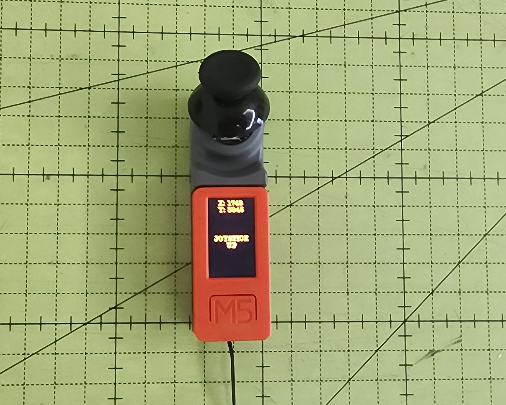
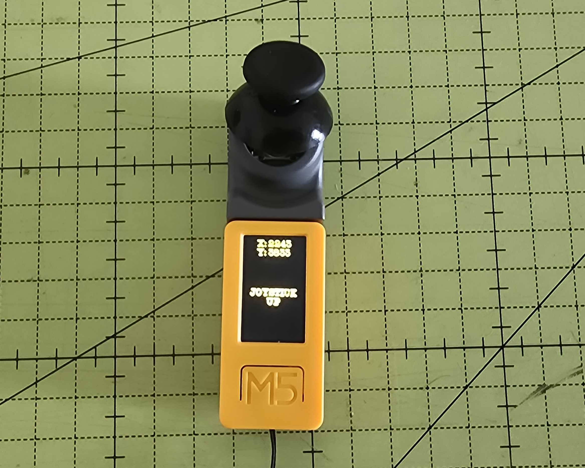
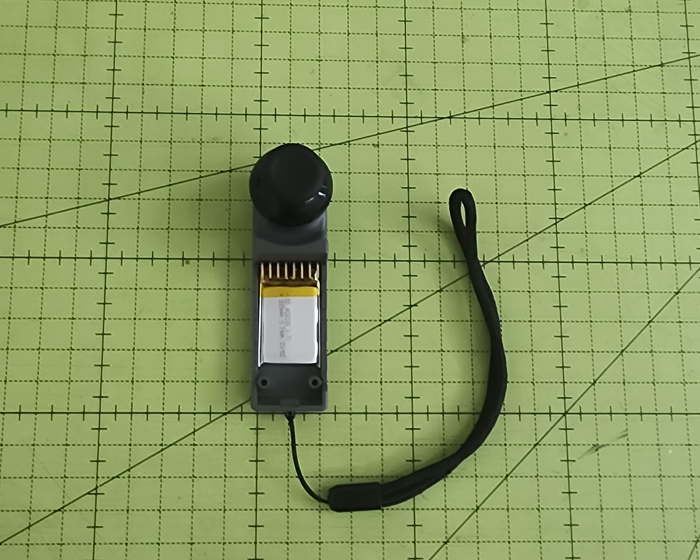
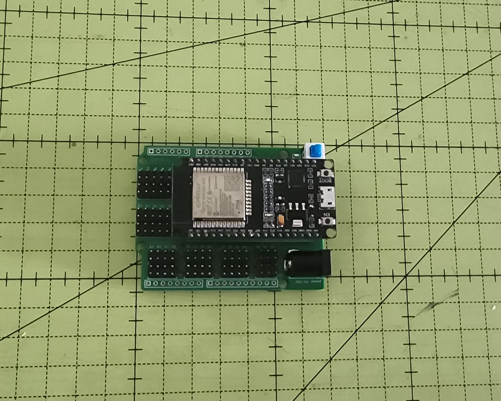

# Project: ESP-NOW Communication Tester with M5 Mini Joystick

## Descriptionh EspNow

This project demonstrates **ESP-NOW** communication using the **M5StickC Plus** with the **M5 Mini JoyC** module as a **transmitter** and an **ESP32 WROOM** as a **receiver**. The goal is to transmit the joystick states — including movements and button presses — to the receiver, where the information is displayed on the **Serial Monitor**.

## Hardware Used

- M5StickC Plus 1



- M5StickC Plus 2



- M5Stack Mini JoyC module (joystick)



- ESP32 DevKit (WROOM)



- USB connection cables


## How It Works

- The **M5StickC Plus** continuously reads the X and Y axis values and the button state from the **Mini JoyC**.
- Based on the readings, the transmitter sends via **ESP-NOW** a numeric identifier corresponding to one of the following actions:
  - `1`: Joystick **Up** (`UP`)
  - `2`: Joystick **Down** (`DOWN`)
  - `3`: Joystick **Left** (`LEFT`)
  - `4`: Joystick **Right** (`RIGHT`)
  - `5`: Joystick **Button Pressed** (`PRESSED`)
  - `6`: Joystick **Stopped** (`STOP`)
- The **ESP32 receiver** receives the ESP-NOW packets, interprets the value, and displays the corresponding action on the **Serial Monitor**.

## Project Structure

```text
├── Code/Transmitter/
│   └── JoyStick-Mini-M5StickCPlus1-EspNow.bin
|   └── JoyStick-Mini-M5StickCPlus2-EspNow.bin
├── Code/Receiver/M5-Joystick-Receiver-Test-Esp32-EspNow/
│   └── M5-Joystick-Receiver-Test-Esp32-EspNow.ino
└── README.md
```

## Required Libraries

- `WiFi.h`
- `esp_now.h`

## How to Use

1. Upload the `JoyStick-Mini-M5StickCPlus1-EspNow.bin` code to the **M5StickC Plus 1** or `JoyStick-Mini-M5StickCPlus2-EspNow.bin` code to the **M5StickC Plus 2** with esptool.
2. Upload the `receiver.ino` code to the **ESP32 WROOM**.
3. Open the **Serial Monitor** in the Arduino IDE set to **115200 baud**.
4. Move the joystick or press the button — the ESP32 will display messages such as:
   - `Joystick UP`
   - `Joystick DOWN`
   - `Joystick LEFT`
   - `Joystick RIGHT`
   - `Joystick PRESSED`
   - `Joystick STOP`

## Uploading Firmware to M5StickC Plus using `esptool`

To upload a firmware binary file to the **M5StickC Plus** using the **`esptool`** command, follow these steps:

### Requirements
- **Python** installed on your computer.
- **esptool** installed via pip:

  ```bash
  pip install esptool

## Step-by-Step Process:

### 1. Connect the M5StickC Plus 1 or M5StickC Plus 2 to Your Computer:
- Use a **USB cable** to connect your **M5StickC Plus** to your computer.

### 2. Find the Serial Port:
- In the **Device Manager** (Windows) or **Terminal** (Linux/macOS), find the serial port that the **M5StickC Plus 1 or M5StickC Plus 2** is connected to.
  - On **Windows**, it will usually appear as `COMx`.
  - On **Linux/macOS**, it will appear as `/dev/ttyUSBx`.

### 3. Put the M5StickC Plus 1 or M5StickC Plus 2 in Flash Mode:
- To put the device in **flash mode**, press and hold the **Power Button** on the **M5StickC Plus 1 or M5StickC Plus 2** while connecting it to your computer. Alternatively, if available, use the **reset button**.

### 4. Use the `esptool` Command to Write the Flash:
- Open a **Command Prompt** (Windows) or **Terminal** (macOS/Linux).
- Run the following command (replace `COMx` with the correct serial port and adjust the binary file name if needed):

  ```bash
  esptool.py --chip esp32 --port COMx write_flash -z 0x1000 JoyStick-Mini-M5StickCPlus1-EspNow.bin
  esptool write_flash -z 0 JoyStick-Mini-M5StickCPlus1-EspNow.bin (With Binary install System32)
  
  or

  esptool.py --chip esp32 --port COMx write_flash -z 0x1000 JoyStick-Mini-M5StickCPlus2-EspNow.bin
  esptool write_flash -z 0 JoyStick-Mini-M5StickCPlus2-EspNow.bin (With Binary install System32)
  ```

## Explanation of the Command:

- `--chip esp32`: Specifies that you're using an **ESP32** chip, which is in the **M5StickC Plus 1 or M5StickC Plus 2**.
- `--port COMx`: Replace `COMx` with the serial port your **M5StickC Plus 1 or M5StickC Plus 2** is connected to. For example, `COM3` on Windows or `/dev/ttyUSB0` on Linux/macOS.
- `write_flash`: This tells **esptool** to write the binary file to the flash memory.
- `-z`: Enables compression of the binary file (if it’s compressed).
- `0x1000`: The starting address where the binary file will be written in the flash memory. This is the standard address for **ESP32** firmware.
- `JoyStick-Mini-M5StickCPlus1-EspNow.bin` or `JoyStick-Mini-M5StickCPlus2-EspNow.bin` : This is the path to your `.bin` file that contains the firmware you want to upload.

## 5. Wait for the Upload to Complete:
- The **esptool** will upload the firmware and show progress in the terminal.
- Once the upload is complete, you'll see a message indicating that the process was successful.

## 6. Restart the M5StickC Plus:
- After the upload finishes, the **M5StickC Plus 1 or M5StickC Plus 2** should automatically restart. The firmware will begin running immediately.

## Example Output from the esptool Command:

```bash
esptool.py v3.1
Connecting........__
Chip is ESP32
Features: WiFi, BT, Dual Core, VBat
Crystal is 40MHz
Uploading stub...
Running stub...
Stub running...
Erasing flash (this may take a while)...
Chip erase completed successfully in 1.2s
Flash params set to 0x0040
Writing flash...
Wrote 40960 bytes at 0x1000 in 4.3 seconds (76.5 KB/s)...
Leaving...
Hard resetting...
```

## Notes

- Make sure both devices are set to operate on a **2.4 GHz Wi-Fi band**.
- The receiver's MAC address must be correctly set in the transmitter code to establish ESP-NOW pairing.
- Messages are transmitted every **200ms**.
- The communication range may vary depending on the environment.